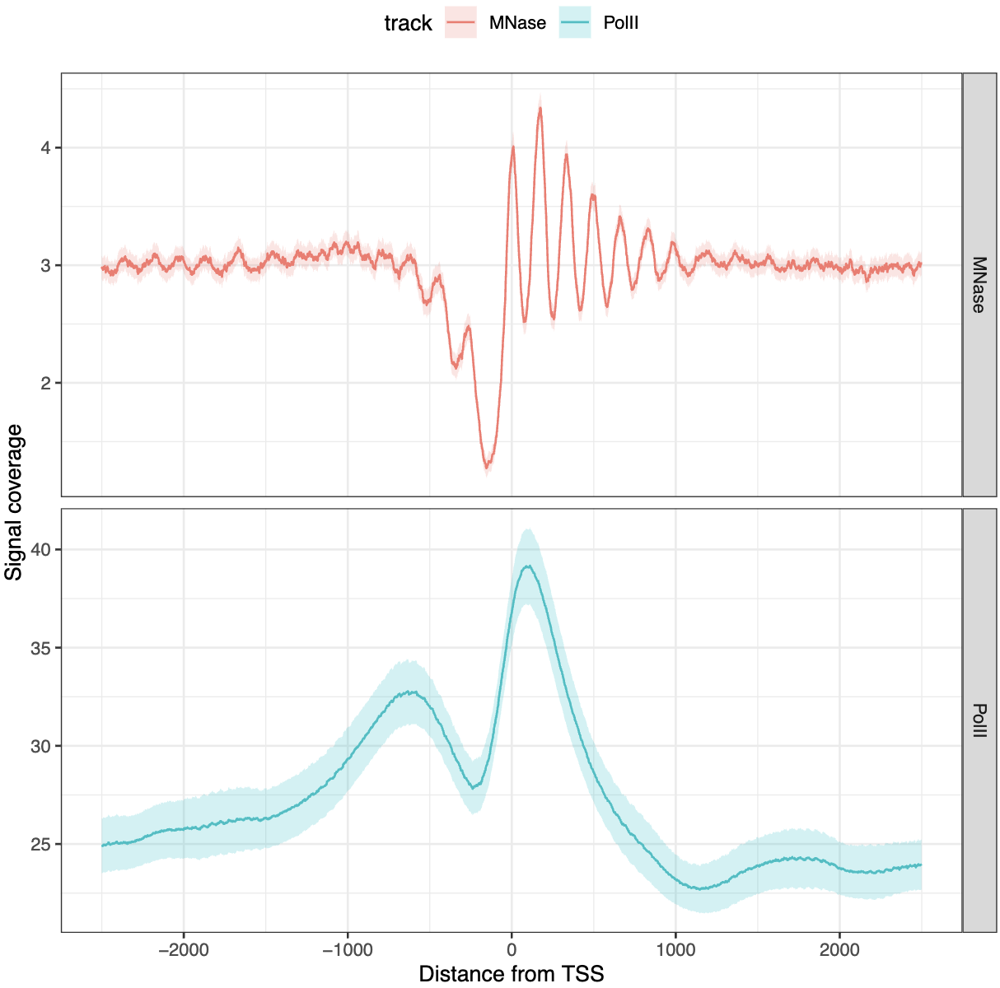
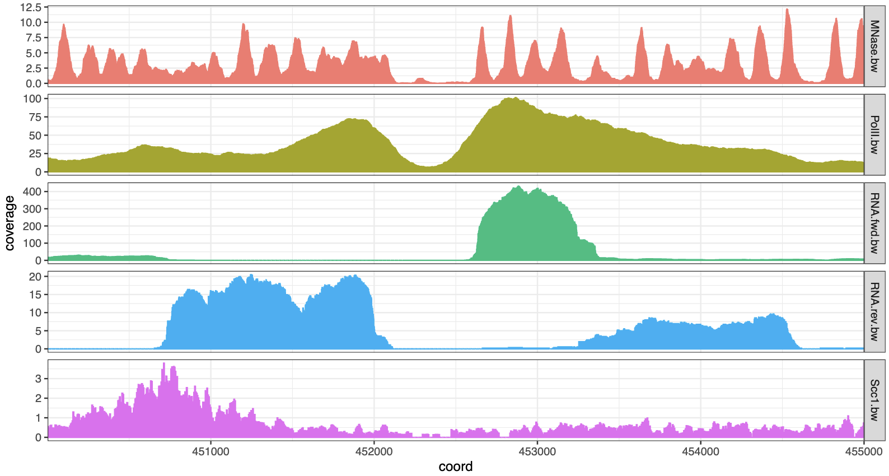

# tidyCoverage

## Load libraries and example datasets

```r
library(tidyCoverage)
library(tidySummarizedExperiment)
library(rtracklayer)
library(plyranges)
library(purrr)
library(ggplot2)

# ~~~~~~~~~~~~~~~ Import genomic features into a named list ~~~~~~~~~~~~~~~ #
features <- list(
    TSSs = system.file("extdata", "TSSs.bed", package = "tidyCoverage"),
    conv_sites = system.file("extdata", "conv_transcription_loci.bed", package = "tidyCoverage")
) |> map(~ import(.x))

# ~~~~~~~~~~~~ Import coverage tracks into a `BigWigFileList` ~~~~~~~~~~~~~ #
tracks <- list(
    Scc1 = system.file("extdata", "Scc1.bw", package = "tidyCoverage"), 
    RNA_fwd = system.file("extdata", "RNA.fwd.bw", package = "tidyCoverage"),
    RNA_rev = system.file("extdata", "RNA.rev.bw", package = "tidyCoverage"),
    PolII = system.file("extdata", "PolII.bw", package = "tidyCoverage"), 
    MNase = system.file("extdata", "MNase.bw", package = "tidyCoverage")
) |> BigWigFileList()
```

## Plot tracks coverage aggregated over genomic features

```r
CoverageExperiment(tracks, features, width = 3000, ignore.strand = FALSE) |> 
    filter(track %in% c('MNase', 'PolII')) |> 
    filter(features == 'TSSs') |> 
    aggregate() |> 
    ggplot(aes(x = coord, y = mean)) + 
    geom_ribbon(aes(ymin = ci_low, ymax = ci_high, fill = track), alpha = 0.2) + 
    geom_line(aes(col = track)) + 
    facet_grid(track ~ ., scales = "free") + 
    labs(x = 'Distance from TSS', y = 'Signal coverage') + 
    theme_bw() + 
    theme(legend.position = 'top')
```



## Plot coverage over a single locus

```r
CoverageExperiment(tracks, GRanges("II:450001-455000"), width = 5000) |> 
    expand() |> 
    ggplot(aes(x = coord, y = coverage)) + 
        geom_col(aes(fill = track, col = track)) + 
        facet_grid(track~., scales = 'free') + 
        scale_x_continuous(expand = c(0, 0)) + 
        theme_bw() + 
        theme(legend.position = "none", aspect.ratio = 0.1)
```


