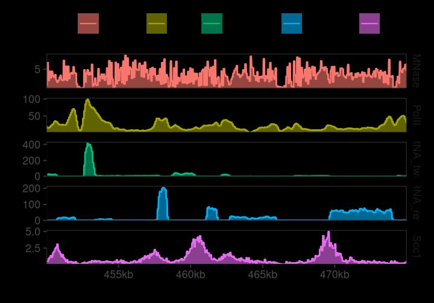
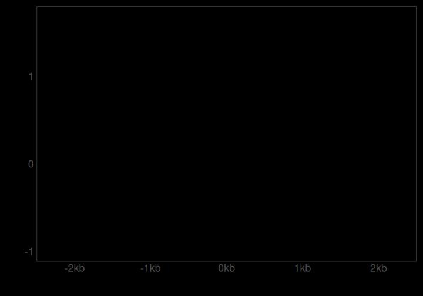
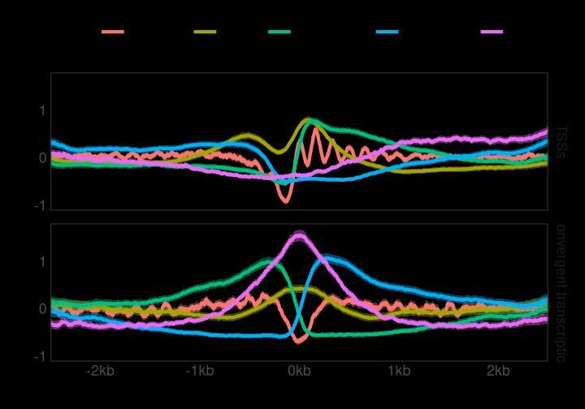
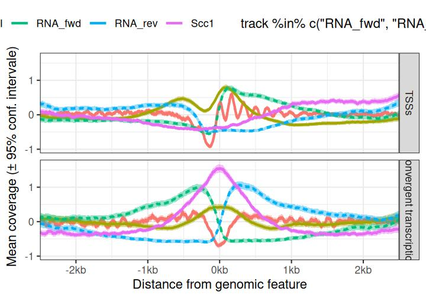
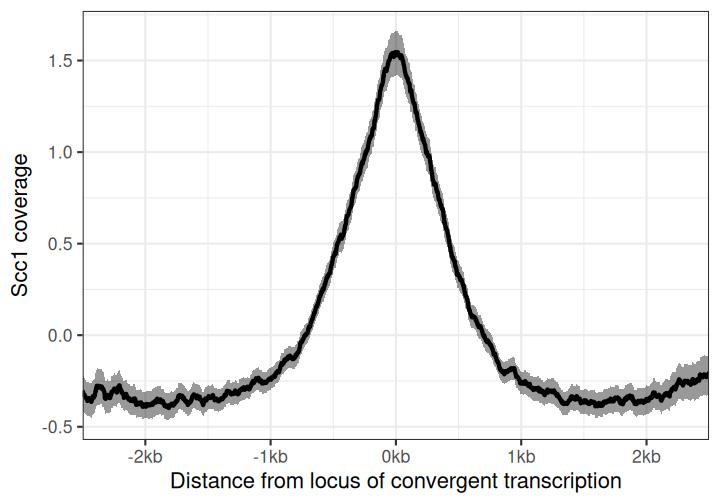
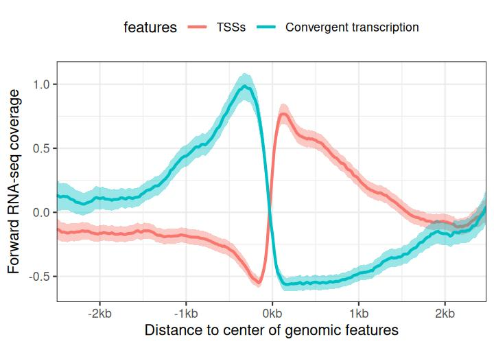
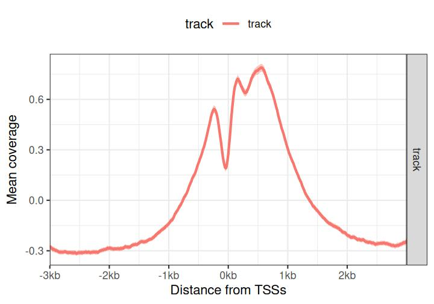
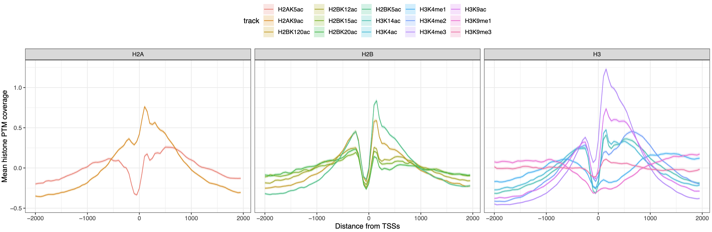

# Introduction to tidyCoverage

## Introduction

Genome-wide assays provide powerful methods to profile the composition,
the conformation and the activity of the chromatin. Linear “coverage”
tracks (generally stored as `.bigwig` files) are one of the outputs
obtained when processing raw high-throughput sequencing data. These
coverage tracks can be inspected in genome interactive browsers
(e.g. `IGV`) to visually appreciate local or global variations in the
coverage of specific genomic assays.

The coverage signal aggregated over multiple genomic features can also
be computed. This approach is very efficient to summarize and compare
the coverage of chromatin modalities (e.g. protein binding profiles from
ChIP-seq, transcription profiles from RNA-seq, chromatin accessibility
from ATAC-seq, …) over hundreds and up to thousands of genomic features
of interest. This unlocks a more quantitative description of the
coverage over groups of genomic features.

`tidyCoverage` implements the `CoverageExperiment` and the
`AggregatedCoverage` classes built on top of the `SummarizedExperiment`
class. These classes formalize the extraction and aggregation of
coverage tracks over sets of genomic features of interests.

## Installation

`tidyCoverage` package can be installed from Bioconductor using the
following command:

``` r

if (!require("BiocManager", quietly = TRUE))
    install.packages("BiocManager")

BiocManager::install("tidyCoverage")
```

## `CoverageExperiment` and `AggregatedCoverage` classes

### `CoverageExperiment`

`tidyCoverage` package defines the `CoverageExperiment`, directly
extending the `SummarizedExperiment` class. This means that all standard
methods available for `SummarizedExperiment`s are available for
`CoverageExperiment` objects.

``` r

library(tidyCoverage)
showClass("CoverageExperiment")
#> Class "CoverageExperiment" [package "tidyCoverage"]
#> 
#> Slots:
#>                                                                 
#> Name:                     rowRanges                      colData
#> Class: GenomicRanges_OR_GRangesList                    DataFrame
#>                                                                 
#> Name:                        assays                        NAMES
#> Class:               Assays_OR_NULL            character_OR_NULL
#>                                                                 
#> Name:               elementMetadata                     metadata
#> Class:                    DataFrame                         list
#> 
#> Extends: 
#> Class "RangedSummarizedExperiment", directly
#> Class "SummarizedExperiment", by class "RangedSummarizedExperiment", distance 2
#> Class "RectangularData", by class "RangedSummarizedExperiment", distance 3
#> Class "Vector", by class "RangedSummarizedExperiment", distance 3
#> Class "Annotated", by class "RangedSummarizedExperiment", distance 4
#> Class "vector_OR_Vector", by class "RangedSummarizedExperiment", distance 4

data(ce)
ce
#> class: CoverageExperiment 
#> dim: 1 2 
#> metadata(0):
#> assays(1): coverage
#> rownames(1): Scc1
#> rowData names(2): features n
#> colnames(2): RNA_fwd RNA_rev
#> colData names(1): track
#> width: 3000

rowData(ce)
#> DataFrame with 1 row and 2 columns
#>         features         n
#>      <character> <integer>
#> Scc1        Scc1       614

rowRanges(ce)
#> GRangesList object of length 1:
#> $Scc1
#> GRanges object with 614 ranges and 2 metadata columns:
#>         seqnames          ranges strand |        name     score
#>            <Rle>       <IRanges>  <Rle> | <character> <numeric>
#>     [1]       II       4290-7289      + |     YBL109W         0
#>     [2]       II       6677-9676      + |     YBL108W         0
#>     [3]       II      7768-10767      + |   YBL107W-A         0
#>     [4]       II     22598-25597      + |     YBL102W         0
#>     [5]       II     26927-29926      + |   YBL100W-C         0
#>     ...      ...             ...    ... .         ...       ...
#>   [610]       IV 1506505-1509504      + |     YDR536W         0
#>   [611]       IV 1509402-1512401      + |     YDR538W         0
#>   [612]       IV 1510594-1513593      + |     YDR539W         0
#>   [613]       IV 1521749-1524748      + |     YDR542W         0
#>   [614]       IV 1524821-1527820      + |     YDR545W         0
#>   -------
#>   seqinfo: 3 sequences from an unspecified genome

colData(ce)
#> DataFrame with 2 rows and 1 column
#>               track
#>         <character>
#> RNA_fwd     RNA_fwd
#> RNA_rev     RNA_rev

assays(ce)
#> List of length 1
#> names(1): coverage

assay(ce, 'coverage')
#>      RNA_fwd        RNA_rev       
#> Scc1 numeric,184200 numeric,184200
```

Note that whereas traditional `SummarizedExperiment` objects store
atomic values stored in individual cells of an assay, each cell of the
`CoverageExperiment` `coverage` assay contains a list of length 1,
itself containing an array. This array stores the per-base coverage
score of a genomic track (from `colData`) over a set of genomic ranges
of interest (from `rowData`).

``` r

assay(ce, 'coverage')
#>      RNA_fwd        RNA_rev       
#> Scc1 numeric,184200 numeric,184200

assay(ce, 'coverage')[1, 1] |> class()
#> [1] "list"

assay(ce, 'coverage')[1, 1] |> length()
#> [1] 1

assay(ce, 'coverage')[1, 1][[1]] |> class()
#> [1] "matrix" "array"

assay(ce, 'coverage')[1, 1][[1]] |> dim()
#> [1] 614 300

# Compare this to `rowData(ce)$n` and `width(ce)`
rowData(ce)$n
#> [1] 614

width(ce)
#> IntegerList of length 1
#> [["Scc1"]] 3000 3000 3000 3000 3000 3000 3000 ... 3000 3000 3000 3000 3000 3000

assay(ce[1, 1], 'coverage')[[1]][1:10, 1:10]
#>             [,1]       [,2]       [,3]       [,4]       [,5]       [,6]
#>  [1,] -0.2573943 -0.2573943 -0.2573943 -0.2573943 -0.2573943 -0.2573943
#>  [2,] -0.2712007 -0.2712007 -0.2712007 -0.2712007 -0.2712007 -0.2712007
#>  [3,] -0.4199078 -0.4199078 -0.4199078 -0.4199078 -0.4199078 -0.4199078
#>  [4,] -0.6413458 -0.6413458 -0.6413458 -0.6413458 -0.6413458 -0.6460800
#>  [5,] -0.5558896 -0.5558896 -0.5558896 -0.5558896 -0.5558896 -0.5558896
#>  [6,]  0.5000157  0.5000157  0.5000157  0.5000157  0.5000157  0.5000157
#>  [7,] -1.1980792 -1.1980792 -1.1980792 -1.1980792 -1.1980792 -1.1980792
#>  [8,]  1.2336717  1.0952403  1.0952403  1.0952403  1.0952403  1.0952403
#>  [9,]  2.0565955  2.0565955  2.0565955  2.0565955  1.9672122  1.9289051
#> [10,] -0.6665461 -0.6665461 -0.6665461 -0.6665461 -0.6665461 -0.6665461
#>             [,7]       [,8]       [,9]      [,10]
#>  [1,] -0.2573943 -0.2573943 -0.2573943 -0.2573943
#>  [2,] -0.2712007 -0.2712007 -0.2712007 -0.2712007
#>  [3,] -0.4199078 -0.4199078 -0.4199078 -0.4199078
#>  [4,] -0.6466060 -0.6466060 -0.6466060 -0.6466060
#>  [5,] -0.5558896 -0.5558896 -0.5558896 -0.5558896
#>  [6,]  0.8920222  1.1533598  1.1533598  1.1533598
#>  [7,] -1.1980792 -1.1980792 -1.1980792 -1.1980792
#>  [8,]  1.0952403  1.1311052  1.4538886  1.4538886
#>  [9,]  1.9289051  1.9289051  1.9289051  1.9289051
#> [10,] -0.6665461 -0.6140548 -0.6082225 -0.6082225
```

### `AggregatedCoverage`

`AggregatedCoverage` also directly extends the `SummarizedExperiment`
class.

``` r

showClass("AggregatedCoverage")
#> Class "AggregatedCoverage" [package "tidyCoverage"]
#> 
#> Slots:
#>                                                                 
#> Name:                     rowRanges                      colData
#> Class: GenomicRanges_OR_GRangesList                    DataFrame
#>                                                                 
#> Name:                        assays                        NAMES
#> Class:               Assays_OR_NULL            character_OR_NULL
#>                                                                 
#> Name:               elementMetadata                     metadata
#> Class:                    DataFrame                         list
#> 
#> Extends: 
#> Class "RangedSummarizedExperiment", directly
#> Class "SummarizedExperiment", by class "RangedSummarizedExperiment", distance 2
#> Class "RectangularData", by class "RangedSummarizedExperiment", distance 3
#> Class "Vector", by class "RangedSummarizedExperiment", distance 3
#> Class "Annotated", by class "RangedSummarizedExperiment", distance 4
#> Class "vector_OR_Vector", by class "RangedSummarizedExperiment", distance 4

data(ac)
ac
#> class: AggregatedCoverage 
#> dim: 1 2 
#> metadata(0):
#> assays(8): mean median ... ci_low ci_high
#> rownames(1): Scc1
#> rowData names(1): features
#> colnames(2): RNA_fwd RNA_rev
#> colData names(1): track
#> width: 3000
#> binning: 1

rowData(ac)
#> DataFrame with 1 row and 1 column
#>         features
#>      <character>
#> Scc1        Scc1

rowRanges(ac)
#> GRangesList object of length 1:
#> $Scc1
#> GRanges object with 614 ranges and 2 metadata columns:
#>         seqnames          ranges strand |        name     score
#>            <Rle>       <IRanges>  <Rle> | <character> <numeric>
#>     [1]       II   234992-237991      + |     YBL002W         0
#>     [2]       II   226136-229135      + |     YBL004W         0
#>     [3]       II   215970-218969      + |     YBL005W         0
#>     [4]       II   219830-222829      + |   YBL005W-B         0
#>     [5]       II   215211-218210      + |   YBL006W-A         0
#>     ...      ...             ...    ... .         ...       ...
#>   [610]       IV 1506505-1509504      + |     YDR536W         0
#>   [611]       IV 1509402-1512401      + |     YDR538W         0
#>   [612]       IV 1510594-1513593      + |     YDR539W         0
#>   [613]       IV 1521749-1524748      + |     YDR542W         0
#>   [614]       IV 1524821-1527820      + |     YDR545W         0
#>   -------
#>   seqinfo: 3 sequences from an unspecified genome

colData(ac)
#> DataFrame with 2 rows and 1 column
#>               track
#>         <character>
#> RNA_fwd     RNA_fwd
#> RNA_rev     RNA_rev

assays(ac)
#> List of length 8
#> names(8): mean median min max sd se ci_low ci_high

assay(ac, 'mean')
#>      RNA_fwd      RNA_rev     
#> Scc1 numeric,3000 numeric,3000
```

It stores per-base coverage statistical metrics in assays (e.g. `mean`,
`median`, …). Each assay thus contains an **matrix of vectors**.

``` r

assay(ac[1, 1], 'mean')[[1]] |> dim()
#> NULL

assay(ac[1, 1], 'mean')[[1]] |> length()
#> [1] 3000

assay(ac[1, 1], 'mean')[[1]][1:10]
#>  [1] -0.09209840 -0.09153138 -0.08975691 -0.09136185 -0.09145762 -0.09119866
#>  [7] -0.09120939 -0.09151991 -0.09073821 -0.09032538
```

## Manipulate `CoverageExperiment` objects

### Create a `CoverageExperiment` object

One can use [`CoverageExperiment()`](../reference/CoverageExperiment.md)
constructor along with:

- A single `bigwig` file imported `as = "Rle"` and a `GRanges` or a
  *named* `GRangesList`;
- A *named* list of `bigwig` files imported `as = "Rle"` and a `GRanges`
  or a *named* `GRangesList`;
- A `BigWigFile` object and a `GRanges` or a *named* `GRangesList`;
- A *named* `BigWigFileList` object and a `GRanges` or a *named*
  `GRangesList`;

A numeric `width` argument also needs to be specified. It is used to
center `features` to their midpoint and resize them to the chosen
`width`.

For example:

``` r

library(rtracklayer)
bw_file <- system.file("extdata", "MNase.bw", package = "tidyCoverage")
bw_file
#> [1] "/__w/_temp/Library/tidyCoverage/extdata/MNase.bw"

bed_file <- system.file("extdata", "TSSs.bed", package = "tidyCoverage")
bed_file
#> [1] "/__w/_temp/Library/tidyCoverage/extdata/TSSs.bed"

CE <- CoverageExperiment(
    tracks = import(bw_file, as = "Rle"), 
    features = import(bed_file),
    width = 3000
)
CE
#> class: CoverageExperiment 
#> dim: 1 1 
#> metadata(0):
#> assays(1): coverage
#> rownames(1): features
#> rowData names(2): features n
#> colnames(1): track
#> colData names(1): track
#> width: 3000
```

And this works as well (note that in this case the names of the
`GRangesList` are being used as `rownames`):

``` r

library(rtracklayer)
bw_file <- system.file("extdata", "MNase.bw", package = "tidyCoverage")
bw_file
#> [1] "/__w/_temp/Library/tidyCoverage/extdata/MNase.bw"

bed_file <- system.file("extdata", "TSSs.bed", package = "tidyCoverage")
bed_file
#> [1] "/__w/_temp/Library/tidyCoverage/extdata/TSSs.bed"

CoverageExperiment(
    tracks = BigWigFile(bw_file), 
    features = GRangesList('TSSs' = import(bed_file)),
    width = 3000
)
#> class: CoverageExperiment 
#> dim: 1 1 
#> metadata(0):
#> assays(1): coverage
#> rownames(1): TSSs
#> rowData names(2): features n
#> colnames(1): track
#> colData names(1): track
#> width: 3000
```

### Bin a `CoverageExperiment` object

By default, `CoverageExperiment` objects store *per-base* track
coverage. This implies that any cell from the `coverage` assay has as
many columns as the `width` provided in the constructor function.

``` r

assay(CE, 'coverage')[1, 1][[1]] |> ncol()
#> [1] 3000
```

If *per-base* resolution is not needed, one can use the `window`
argument in the constructor function to average the coverage score over
non-overlapping bins.

``` r

CE2 <- CoverageExperiment(
    tracks = import(bw_file, as = "Rle"), 
    features = import(bed_file),
    width = 3000, 
    window = 20
)

CE2
#> class: CoverageExperiment 
#> dim: 1 1 
#> metadata(0):
#> assays(1): coverage
#> rownames(1): features
#> rowData names(2): features n
#> colnames(1): track
#> colData names(1): track
#> width: 3000

assay(CE2, 'coverage')[1, 1][[1]] |> ncol()
#> [1] 150
```

If a `CoverageExperiment` object has already been computed, the
[`coarsen()`](../reference/CoverageExperiment.md) function can be used
afterwards to reduce the resolution of the object.

``` r

CE3 <- coarsen(CE, window = 20)

CE3 
#> class: CoverageExperiment 
#> dim: 1 1 
#> metadata(0):
#> assays(1): coverage
#> rownames(1): features
#> rowData names(2): features n
#> colnames(1): track
#> colData names(1): track
#> width: 3000

identical(CE2, CE3)
#> [1] TRUE
```

### Expand a `CoverageExperiment` object

The `expand` method from the `tidyr` package is adapted to
`CoverageExperiment` objects to return a tidy `tibble`. This reformated
object contains several columns:

1.  `track`: storing `colnames`, i.e. names of tracks used in the
    original `CoverageExperiment`;
2.  `features`: storing `rownames`, i.e. names of features used in the
    original `CoverageExperiment`;
3.  `chr`: features `seqnames` from the `CoverageExperiment`;
4.  `ranges`: features from the `CoverageExperiment` coerced as
    `character`;
5.  `strand`: features `strand` from the `CoverageExperiment`;
6.  `coord`: exact genomic position from the `CoverageExperiment`;
7.  `coverage`: coverage score extracted from corresponding `track` at
    `chr:coord`;
8.  `coord.scaled`: 0-centered genomic position;

``` r

expand(CE)
#> # A tibble: 5,355,000 × 8
#> # Groups:   track, features, ranges [1,785]
#>    track features chr   ranges             strand  coord coverage coord.scaled
#>    <chr> <fct>    <chr> <chr>              <chr>   <dbl>    <dbl>        <dbl>
#>  1 track features II    II:235967-238966:- -      235967     1.30        -1500
#>  2 track features II    II:235967-238966:- -      235968     1.30        -1499
#>  3 track features II    II:235967-238966:- -      235969     1.30        -1498
#>  4 track features II    II:235967-238966:- -      235970     1.30        -1497
#>  5 track features II    II:235967-238966:- -      235971     1.30        -1496
#>  6 track features II    II:235967-238966:- -      235972     1.30        -1495
#>  7 track features II    II:235967-238966:- -      235973     1.30        -1494
#>  8 track features II    II:235967-238966:- -      235974     1.30        -1493
#>  9 track features II    II:235967-238966:- -      235975     1.30        -1492
#> 10 track features II    II:235967-238966:- -      235976     1.30        -1491
#> # ℹ 5,354,990 more rows
```

Note that if the `CoverageExperiment` object has been coarsened using
`window = ...`, the `coord` and `coord.scaled` are handled
correspondingly.

``` r

expand(CE3)
#> # A tibble: 267,750 × 8
#> # Groups:   track, features, ranges [1,785]
#>    track features chr   ranges             strand  coord coverage coord.scaled
#>    <chr> <fct>    <chr> <chr>              <chr>   <dbl>    <dbl>        <dbl>
#>  1 track features II    II:235967-238966:- -      235967    1.30         -1500
#>  2 track features II    II:235967-238966:- -      235987    1.30         -1480
#>  3 track features II    II:235967-238966:- -      236007    0.527        -1460
#>  4 track features II    II:235967-238966:- -      236027    0.111        -1440
#>  5 track features II    II:235967-238966:- -      236047    0.111        -1420
#>  6 track features II    II:235967-238966:- -      236067    0.111        -1400
#>  7 track features II    II:235967-238966:- -      236087    0.182        -1380
#>  8 track features II    II:235967-238966:- -      236107    0.190        -1360
#>  9 track features II    II:235967-238966:- -      236127    0.190        -1340
#> 10 track features II    II:235967-238966:- -      236147    0.189        -1320
#> # ℹ 267,740 more rows
```

### Plot coverage of a set of tracks over a single genomic locus

To illustrate how to visualize coverage tracks from a
`CoverageExperiment` object over a single genomic locus of interest,
let’s use sample data provided in the `tidyCoverage` package.

``` r

# ~~~~~~~~~~~~~~~ Import coverage tracks into a named list ~~~~~~~~~~~~~~~ #
tracks <- list(
    Scc1 = system.file("extdata", "Scc1.bw", package = "tidyCoverage"), 
    RNA_fwd = system.file("extdata", "RNA.fwd.bw", package = "tidyCoverage"),
    RNA_rev = system.file("extdata", "RNA.rev.bw", package = "tidyCoverage"),
    PolII = system.file("extdata", "PolII.bw", package = "tidyCoverage"), 
    MNase = system.file("extdata", "MNase.bw", package = "tidyCoverage")
) |> BigWigFileList()

locus <- GRanges("II:450001-475000")

# ~~~~~~~~~~~~~~~ Instantiate a CoverageExperiment object ~~~~~~~~~~~~~~~ #
CE_chrII <- CoverageExperiment(
    tracks = tracks, 
    features = locus,
    width = width(locus)
)

CE_chrII
#> class: CoverageExperiment 
#> dim: 1 5 
#> metadata(0):
#> assays(1): coverage
#> rownames(1): features
#> rowData names(2): features n
#> colnames(5): Scc1 RNA_fwd RNA_rev PolII MNase
#> colData names(1): track
#> width: 25000
```

From there, it is easy to (optionally) `coarsen` then `expand` the
`CoverageExperiment` into a `tibble` and use `ggplot2` for
visualization.

``` r

library(ggplot2)
CE_chrII |> 
    coarsen(window = 10) |> 
    expand() |> 
    ggplot() + 
    geom_coverage(aes(fill = track)) + 
    facet_grid(track~., scales = 'free')
```



In this plot, each facet represents the coverage of a different genomic
track over a single region of interest (`chrII:450001-475000`). Each
facet has independent scaling thanks to
`facet_grid(..., scales = free)`.

## Manipulate `AggregatedCoverage` objects

### Aggregate a `CoverageExperiment` into an `AggregatedCoverage` object

It is often useful to
[`aggregate()`](https://rdrr.io/r/stats/aggregate.html) genomic `tracks`
coverage over a set of genomic `features`.

``` r

AC <- aggregate(CE)

AC
#> class: AggregatedCoverage 
#> dim: 1 1 
#> metadata(0):
#> assays(8): mean median ... ci_low ci_high
#> rownames(1): features
#> rowData names(2): features n
#> colnames(1): track
#> colData names(1): track
#> width: 3000
#> binning: 1

assay(AC, 'mean')[1, 1][[1]] |> length()
#> [1] 3000
```

``` r

AC20 <- aggregate(CE, bin = 20)
AC20
#> class: AggregatedCoverage 
#> dim: 1 1 
#> metadata(0):
#> assays(8): mean median ... ci_low ci_high
#> rownames(1): features
#> rowData names(2): features n
#> colnames(1): track
#> colData names(1): track
#> width: 3000
#> binning: 20

assay(AC20, 'mean')[1, 1][[1]] |> length()
#> [1] 150
```

The resulting `AggregatedCoverage` objects can be readily coerced into a
`tibble`.

``` r

as_tibble(AC20)
#> # A tibble: 150 × 13
#>    .sample .feature track features coord  mean median   min   max    sd     se
#>    <chr>   <fct>    <chr> <fct>    <dbl> <dbl>  <dbl> <dbl> <dbl> <dbl>  <dbl>
#>  1 track   features track features -1500  2.99   2.89     0  9.51  1.75 0.0415
#>  2 track   features track features -1480  3.01   2.92     0  9.56  1.76 0.0416
#>  3 track   features track features -1460  3.07   2.96     0 10.4   1.79 0.0425
#>  4 track   features track features -1440  3.13   3.00     0 10.4   1.81 0.0428
#>  5 track   features track features -1420  3.13   2.99     0 10.4   1.81 0.0428
#>  6 track   features track features -1400  3.12   2.98     0 10.1   1.81 0.0428
#>  7 track   features track features -1380  3.06   2.95     0  9.54  1.79 0.0424
#>  8 track   features track features -1360  3.01   2.93     0 10.2   1.79 0.0423
#>  9 track   features track features -1340  3.06   2.98     0 10.6   1.80 0.0426
#> 10 track   features track features -1320  3.03   2.95     0 10.6   1.80 0.0426
#> # ℹ 140 more rows
#> # ℹ 2 more variables: ci_low <dbl>, ci_high <dbl>
```

Note that the `coarsen-then-aggregate` or `aggregate-by-bin` are **NOT**
equivalent. This is due to the certain operations being not commutative
with `mean` (e.g. `sd`, `min`/`max`, …).

``` r

# Coarsen `CoverageExperiment` with `window = ...` then per-bin `aggregate`:
CoverageExperiment(
    tracks = import(bw_file, as = "Rle"), features = import(bed_file),
    width = 3000
) |> 
    coarsen(window = 20) |> ## FIRST COARSEN...
    aggregate() |>          ## ... THEN AGGREGATE
    as_tibble()
#> # A tibble: 150 × 13
#>    .sample .feature track features coord  mean median   min   max    sd     se
#>    <chr>   <fct>    <chr> <fct>    <dbl> <dbl>  <dbl> <dbl> <dbl> <dbl>  <dbl>
#>  1 track   features track features -1500  2.99   2.95     0  9.01  1.65 0.0391
#>  2 track   features track features -1480  3.01   2.97     0  9.52  1.67 0.0396
#>  3 track   features track features -1460  3.07   3.00     0 10.4   1.70 0.0402
#>  4 track   features track features -1440  3.13   3.04     0 10.4   1.72 0.0407
#>  5 track   features track features -1420  3.13   3.01     0 10.4   1.72 0.0407
#>  6 track   features track features -1400  3.12   3.02     0  9.28  1.71 0.0405
#>  7 track   features track features -1380  3.06   3.01     0  9.23  1.70 0.0402
#>  8 track   features track features -1360  3.01   2.94     0  9.68  1.70 0.0401
#>  9 track   features track features -1340  3.06   3.01     0 10.6   1.71 0.0405
#> 10 track   features track features -1320  3.03   2.99     0 10.6   1.71 0.0404
#> # ℹ 140 more rows
#> # ℹ 2 more variables: ci_low <dbl>, ci_high <dbl>

# Per-base `CoverageExperiment` then `aggregate` with `bin = ...`: 
CoverageExperiment(
    tracks = import(bw_file, as = "Rle"), features = import(bed_file),
    width = 3000
) |> 
    aggregate(bin = 20) |>  ## DIRECTLY AGGREGATE BY BIN
    as_tibble()
#> # A tibble: 150 × 13
#>    .sample .feature track features coord  mean median   min   max    sd     se
#>    <chr>   <fct>    <chr> <fct>    <dbl> <dbl>  <dbl> <dbl> <dbl> <dbl>  <dbl>
#>  1 track   features track features -1500  2.99   2.89     0  9.51  1.75 0.0415
#>  2 track   features track features -1480  3.01   2.92     0  9.56  1.76 0.0416
#>  3 track   features track features -1460  3.07   2.96     0 10.4   1.79 0.0425
#>  4 track   features track features -1440  3.13   3.00     0 10.4   1.81 0.0428
#>  5 track   features track features -1420  3.13   2.99     0 10.4   1.81 0.0428
#>  6 track   features track features -1400  3.12   2.98     0 10.1   1.81 0.0428
#>  7 track   features track features -1380  3.06   2.95     0  9.54  1.79 0.0424
#>  8 track   features track features -1360  3.01   2.93     0 10.2   1.79 0.0423
#>  9 track   features track features -1340  3.06   2.98     0 10.6   1.80 0.0426
#> 10 track   features track features -1320  3.03   2.95     0 10.6   1.80 0.0426
#> # ℹ 140 more rows
#> # ℹ 2 more variables: ci_low <dbl>, ci_high <dbl>
```

### `AggregatedCoverage` over multiple tracks / feature sets

As en example for the rest of this vignette, we compute an
`AggregatedCoverage` object using multiple genomic track files and
multiple sets of genomic ranges.

``` r

library(purrr)
#> 
#> Attaching package: 'purrr'
#> The following object is masked from 'package:GenomicRanges':
#> 
#>     reduce
#> The following object is masked from 'package:IRanges':
#> 
#>     reduce
library(plyranges)
#> 
#> Attaching package: 'plyranges'
#> The following objects are masked from 'package:dplyr':
#> 
#>     between, n, n_distinct

# ~~~~~~~~~~~~~~~ Import genomic features into a named list ~~~~~~~~~~~~~~~ #
features <- list(
    TSSs = system.file("extdata", "TSSs.bed", package = "tidyCoverage"),
    `Convergent transcription` = system.file("extdata", "conv_transcription_loci.bed", package = "tidyCoverage")
) |> map(import) |> map(filter, strand == '+') 

# ~~~~~~~~~~~~~~~ Import coverage tracks into a named list ~~~~~~~~~~~~~~~ #
tracks <- list(
    Scc1 = system.file("extdata", "Scc1.bw", package = "tidyCoverage"), 
    RNA_fwd = system.file("extdata", "RNA.fwd.bw", package = "tidyCoverage"),
    RNA_rev = system.file("extdata", "RNA.rev.bw", package = "tidyCoverage"),
    PolII = system.file("extdata", "PolII.bw", package = "tidyCoverage"), 
    MNase = system.file("extdata", "MNase.bw", package = "tidyCoverage")
) |> map(import, as = 'Rle')

# ~~~~~~~~~~~~~~~ Compute aggregated coverage ~~~~~~~~~~~~~~~ #
CE <- CoverageExperiment(tracks, features, width = 5000, scale = TRUE, center = TRUE)
CE
#> class: CoverageExperiment 
#> dim: 2 5 
#> metadata(0):
#> assays(1): coverage
#> rownames(2): TSSs Convergent transcription
#> rowData names(2): features n
#> colnames(5): Scc1 RNA_fwd RNA_rev PolII MNase
#> colData names(1): track
#> width: 5000

AC <- aggregate(CE)
AC
#> class: AggregatedCoverage 
#> dim: 2 5 
#> metadata(0):
#> assays(8): mean median ... ci_low ci_high
#> rownames(2): TSSs Convergent transcription
#> rowData names(2): features n
#> colnames(5): Scc1 RNA_fwd RNA_rev PolII MNase
#> colData names(1): track
#> width: 5000
#> binning: 1
```

### Plot aggregated coverages with `ggplot2`

Because `AggregatedCoverage` objects can be easily coerced into
`tibble`s, the full range of `ggplot2` functionalities can be exploited
to plot aggregated coverage signal of multiple tracks over multiple sets
of genomic ranges.

``` r

AC |> 
    as_tibble() |> 
    ggplot() + 
    geom_aggrcoverage()
```



Oopsie, a little busy here. Let’s color by tracks and split facets by
`features`:

``` r

AC |> 
    as_tibble() |> 
    ggplot(aes(col = track)) + 
    geom_aggrcoverage() + 
    facet_grid(features ~ .)
```



Nearly there, few cosmetic changes and we are done!

``` r

AC |> 
    as_tibble() |> 
    ggplot(aes(col = track, linetype = track %in% c('RNA_fwd', 'RNA_rev'))) + 
    geom_aggrcoverage() + 
    facet_grid(features ~ .) + 
    labs(x = 'Distance from genomic feature', y = 'Mean coverage (± 95% conf. intervale)') + 
    theme_bw() + 
    theme(legend.position = 'top')
```



## Use a tidy grammar

`tidySummarizedExperiment` package implements native `tidyverse`
functionalities to `SummarizedExperiment` objects and their extensions.
It tweaks the way `CoverageExperiment` and `AggregatedCoverage` objects
look and feel, but do not change the underlying data or object.

In particular, this means that data wrangling *verbs* provided by
`dplyr` can directly work on `CoverageExperiment` and
`AggregatedCoverage` objects, provided that the
`tidySummarizedExperiment` package is loaded.

``` r

library(tidySummarizedExperiment)
#> Loading required package: ttservice
#> 
#> Attaching package: 'ttservice'
#> The following objects are masked from 'package:dplyr':
#> 
#>     bind_cols, bind_rows
#> tidySummarizedExperiment says: Printing is now handled externally. If you want to visualize the data in a tidy way, do library(tidyprint). See https://github.com/tidyomics/tidyprint for more information.
#> 
#> Attaching package: 'tidySummarizedExperiment'
#> The following object is masked from 'package:generics':
#> 
#>     tidy
CE
#> Warning: `when()` was deprecated in purrr 1.0.0.
#> ℹ Please use `if` instead.
#> ℹ The deprecated feature was likely used in the tidySummarizedExperiment
#>   package.
#>   Please report the issue at
#>   <https://github.com/stemangiola/tidySummarizedExperiment/issues>.
#> This warning is displayed once every 8 hours.
#> Call `lifecycle::last_lifecycle_warnings()` to see where this warning was
#> generated.
#> # A CoverageExperiment-tibble abstraction: 10 × 7
#> # features=2 | tracks=5 | assays=coverage
#> # width=5000
#>    .feature                 .sample coverage track   features      n GRangesList
#>    <chr>                    <chr>   <list>   <chr>   <chr>     <int> <list>     
#>  1 TSSs                     Scc1    <dbl[…]> Scc1    TSSs        869 <tibble>   
#>  2 Convergent transcription Scc1    <dbl[…]> Scc1    Converge…   468 <tibble>   
#>  3 TSSs                     RNA_fwd <dbl[…]> RNA_fwd TSSs        869 <tibble>   
#>  4 Convergent transcription RNA_fwd <dbl[…]> RNA_fwd Converge…   468 <tibble>   
#>  5 TSSs                     RNA_rev <dbl[…]> RNA_rev TSSs        869 <tibble>   
#>  6 Convergent transcription RNA_rev <dbl[…]> RNA_rev Converge…   468 <tibble>   
#>  7 TSSs                     PolII   <dbl[…]> PolII   TSSs        869 <tibble>   
#>  8 Convergent transcription PolII   <dbl[…]> PolII   Converge…   468 <tibble>   
#>  9 TSSs                     MNase   <dbl[…]> MNase   TSSs        869 <tibble>   
#> 10 Convergent transcription MNase   <dbl[…]> MNase   Converge…   468 <tibble>

AC <- CE |> 
    filter(track == 'Scc1') |> 
    filter(features == 'Convergent transcription') |> 
    aggregate()

AC
#> # An AggregatedCoverage-tibble abstraction: 5000 × 13
#> # features=1 | tracks=1 | assays=mean, median, min, max, sd, se, ci_low,
#> #   ci_high
#> # width=5000 | binning=1
#>    .sample .feature  track features coord   mean median   min   max    sd     se
#>    <chr>   <fct>     <chr> <fct>    <dbl>  <dbl>  <dbl> <dbl> <dbl> <dbl>  <dbl>
#>  1 Scc1    Converge… Scc1  Converg… -2500 -0.306 -0.649 -2.50  5.00  1.07 0.0495
#>  2 Scc1    Converge… Scc1  Converg… -2499 -0.307 -0.652 -2.50  5.00  1.07 0.0495
#>  3 Scc1    Converge… Scc1  Converg… -2498 -0.309 -0.654 -2.50  5.00  1.07 0.0494
#>  4 Scc1    Converge… Scc1  Converg… -2497 -0.310 -0.654 -2.50  5.00  1.07 0.0493
#>  5 Scc1    Converge… Scc1  Converg… -2496 -0.318 -0.666 -2.50  5.00  1.07 0.0493
#>  6 Scc1    Converge… Scc1  Converg… -2495 -0.320 -0.668 -2.50  5.00  1.07 0.0493
#>  7 Scc1    Converge… Scc1  Converg… -2494 -0.319 -0.668 -2.50  5.00  1.07 0.0494
#>  8 Scc1    Converge… Scc1  Converg… -2493 -0.322 -0.668 -2.50  5.00  1.06 0.0490
#>  9 Scc1    Converge… Scc1  Converg… -2492 -0.322 -0.667 -2.50  5.00  1.06 0.0488
#> 10 Scc1    Converge… Scc1  Converg… -2491 -0.321 -0.662 -2.50  5.00  1.06 0.0488
#> # ℹ 4,990 more rows
#> # ℹ 2 more variables: ci_low <dbl>, ci_high <dbl>
```

This also means that
[`as_tibble()`](https://tibble.tidyverse.org/reference/as_tibble.html)
coercing step is facultative if the `tidySummarizedExperiment` package
id loaded.

``` r

AC |> 
    ggplot() + 
    geom_aggrcoverage() + 
    labs(x = 'Distance from locus of convergent transcription', y = 'Scc1 coverage') + 
    theme_bw() + 
    theme(legend.position = 'top')
```



**Note:** To read more about the `tidySummarizedExperiment` package and
the overall `tidyomics` project, read the preprint
[here](https://www.biorxiv.org/content/10.1101/2023.09.10.557072v2).

### Example workflow using tidy grammar

``` r

CoverageExperiment(tracks, features, width = 5000, scale = TRUE, center = TRUE) |> 
    filter(track == 'RNA_fwd') |> 
    aggregate(bin = 20) |> 
    ggplot(col = features) + 
    geom_aggrcoverage(aes(col = features)) + 
    labs(x = 'Distance to center of genomic features', y = 'Forward RNA-seq coverage') + 
    theme_bw() + 
    theme(legend.position = 'top')
```



## Example use case: `AnnotationHub` and `TxDb` resources

### Recover TSSs of forward mouse genes

Let’s first fetch features of interest from the mouse `TxDb` resources.

``` r

txdb <- TxDb.Mmusculus.UCSC.mm10.knownGene::TxDb.Mmusculus.UCSC.mm10.knownGene
TSSs <- GenomicFeatures::genes(txdb) |> 
    filter(strand == '+') |> 
    anchor_5p() |> 
    mutate(width = 1)
#>   66 genes were dropped because they have exons located on both strands of the
#>   same reference sequence or on more than one reference sequence, so cannot be
#>   represented by a single genomic range.
#>   Use 'single.strand.genes.only=FALSE' to get all the genes in a GRangesList
#>   object, or use suppressMessages() to suppress this message.
```

These 1bp-wide `GRanges` correspond to forward TSSs genomic positions.

### Recover H3K4me3 coverage track from AnnotationHub

Let’s also fetch a real-life ChIP-seq dataset (e.g. `H3K4me3`) stored in
the `AnnotationHub`:

``` r

library(AnnotationHub)
#> Loading required package: BiocFileCache
#> Loading required package: dbplyr
#> 
#> Attaching package: 'dbplyr'
#> The following objects are masked from 'package:dplyr':
#> 
#>     ident, sql
#> 
#> Attaching package: 'AnnotationHub'
#> The following object is masked from 'package:rtracklayer':
#> 
#>     hubUrl
#> The following object is masked from 'package:Biobase':
#> 
#>     cache
ah <- AnnotationHub()
ah['AH27840']
#> AnnotationHub with 1 record
#> # snapshotDate(): 2025-11-14
#> # names(): AH27840
#> # $dataprovider: Haemcode
#> # $species: Mus musculus
#> # $rdataclass: BigWigFile
#> # $rdatadateadded: 2015-03-12
#> # $title: H3K4me3_GSE40918_Th17_RORg_wt_T_Cells.bw
#> # $description: bigWig file from Haemcode
#> # $taxonomyid: 10090
#> # $genome: mm10
#> # $sourcetype: BigWig
#> # $sourceurl: http://haemcode.stemcells.cam.ac.uk/blood/BigWig/mm10/H3K4me3_...
#> # $sourcesize: 175887600
#> # $tags: c("H3K4me3_GSE40918_Th17_RORg_wt_T_Cells", "T-Cells", "[PC]
#> #   Th17", "", "H3K4me3", "GSE40918", "GSM1004815-7 ", "histone") 
#> # retrieve record with 'object[["AH27840"]]'
H3K4me3_bw <- ah[['AH27840']]
#> loading from cache

H3K4me3_bw
#> BigWigFile object
#> resource: /github/home/.cache/R/AnnotationHub/1c4f7c7fbac2_33280
```

### Compute the aggregated coverage of H3K4me3 ± 3kb around the TSSs of forward mouse genes

We can now extract the coverage of `H3K4me3` over all the mouse forward
TSSs (± 3kb) and aggregate this coverage.

``` r

CoverageExperiment(
    H3K4me3_bw, TSSs, 
    width = 6000, 
    scale = TRUE, center = TRUE
) |> 
    aggregate() |> 
    ggplot() + 
    geom_aggrcoverage(aes(col = track)) + 
    facet_grid(track ~ .) + 
    labs(x = 'Distance from TSSs', y = 'Mean coverage') + 
    theme_bw() + 
    theme(legend.position = 'top')
```



We obtain the typical profile of enrichment of `H3K4me3` over the +1
nucleosome.

### With more genomic tracks

This more complex example fetches a collection of 15 different ChIP-seq
genomic tracks to check their profile of enrichment over mouse forward
TSSs.

``` r

# ~~~~~~~~~~ Recover 15 different histone PTM ChIP-seq tracks ~~~~~~~~~~ #
ids <- c(
    'AH35163', 'AH35165', 'AH35167', 'AH35170', 'AH35173', 'AH35176', 
    'AH35178', 'AH35180', 'AH35182', 'AH35185', 'AH35187', 'AH35189', 
    'AH35191', 'AH35193', 'AH35196'
)
names(ids) <- mcols(ah[ids])$title |> 
    gsub(".*IMR90.", "", x = _) |> 
    gsub("\\..*", "", x = _)
bws <- map(ids, ~ ah[[.x]]) |> 
    map(resource) |> 
    BigWigFileList()
names(bws) <- names(ids)

# ~~~~~~~~~~ Computing coverage over TSSs ~~~~~~~~~~ #
AC <- CoverageExperiment(
    bws, TSSs, 
    width = 4000, 
    scale = TRUE, center = TRUE
) |> aggregate()

# ~~~~~~~~~~ Plot the resulting AggregatedCoverage object ~~~~~~~~~~ #
AC |> 
    as_tibble() |> 
    mutate(
        histone = dplyr::case_when(
            stringr::str_detect(track, 'H2A') ~ "H2A", 
            stringr::str_detect(track, 'H2B') ~ "H2B", 
            stringr::str_detect(track, 'H3') ~ "H3"
        )
    ) |> 
    ggplot() + 
    geom_aggrcoverage(aes(col = track)) + 
    facet_grid(~histone) + 
    labs(x = 'Distance from TSSs', y = 'Mean histone PTM coverage') + 
    hues::scale_colour_iwanthue() + 
    hues::scale_fill_iwanthue() 
```



## Session info

``` r

sessionInfo()
#> R Under development (unstable) (2025-12-21 r89216)
#> Platform: x86_64-pc-linux-gnu
#> Running under: Ubuntu 24.04.3 LTS
#> 
#> Matrix products: default
#> BLAS:   /usr/lib/x86_64-linux-gnu/openblas-pthread/libblas.so.3 
#> LAPACK: /usr/lib/x86_64-linux-gnu/openblas-pthread/libopenblasp-r0.3.26.so;  LAPACK version 3.12.0
#> 
#> locale:
#>  [1] LC_CTYPE=en_US.UTF-8       LC_NUMERIC=C              
#>  [3] LC_TIME=en_US.UTF-8        LC_COLLATE=en_US.UTF-8    
#>  [5] LC_MONETARY=en_US.UTF-8    LC_MESSAGES=en_US.UTF-8   
#>  [7] LC_PAPER=en_US.UTF-8       LC_NAME=C                 
#>  [9] LC_ADDRESS=C               LC_TELEPHONE=C            
#> [11] LC_MEASUREMENT=en_US.UTF-8 LC_IDENTIFICATION=C       
#> 
#> time zone: UTC
#> tzcode source: system (glibc)
#> 
#> attached base packages:
#> [1] stats4    stats     graphics  grDevices utils     datasets  methods  
#> [8] base     
#> 
#> other attached packages:
#>  [1] AnnotationHub_4.1.0             BiocFileCache_3.1.0            
#>  [3] dbplyr_2.5.1                    tidySummarizedExperiment_1.21.0
#>  [5] ttservice_0.5.3                 plyranges_1.31.1               
#>  [7] purrr_1.2.0                     rtracklayer_1.71.3             
#>  [9] ggplot2_4.0.1                   tidyr_1.3.2                    
#> [11] dplyr_1.1.4                     tidyCoverage_1.7.0             
#> [13] SummarizedExperiment_1.41.0     Biobase_2.71.0                 
#> [15] GenomicRanges_1.63.1            Seqinfo_1.1.0                  
#> [17] IRanges_2.45.0                  S4Vectors_0.49.0               
#> [19] BiocGenerics_0.57.0             generics_0.1.4                 
#> [21] MatrixGenerics_1.23.0           matrixStats_1.5.0              
#> [23] BiocStyle_2.39.0               
#> 
#> loaded via a namespace (and not attached):
#>  [1] DBI_1.2.3                                
#>  [2] bitops_1.0-9                             
#>  [3] httr2_1.2.2                              
#>  [4] rlang_1.1.6                              
#>  [5] magrittr_2.0.4                           
#>  [6] otel_0.2.0                               
#>  [7] compiler_4.6.0                           
#>  [8] RSQLite_2.4.5                            
#>  [9] GenomicFeatures_1.63.1                   
#> [10] png_0.1-8                                
#> [11] systemfonts_1.3.1                        
#> [12] vctrs_0.6.5                              
#> [13] stringr_1.6.0                            
#> [14] pkgconfig_2.0.3                          
#> [15] crayon_1.5.3                             
#> [16] fastmap_1.2.0                            
#> [17] XVector_0.51.0                           
#> [18] ellipsis_0.3.2                           
#> [19] labeling_0.4.3                           
#> [20] utf8_1.2.6                               
#> [21] Rsamtools_2.27.0                         
#> [22] rmarkdown_2.30                           
#> [23] UCSC.utils_1.7.1                         
#> [24] ggbeeswarm_0.7.3                         
#> [25] ragg_1.5.0                               
#> [26] bit_4.6.0                                
#> [27] xfun_0.55                                
#> [28] cachem_1.1.0                             
#> [29] cigarillo_1.1.0                          
#> [30] GenomeInfoDb_1.47.2                      
#> [31] jsonlite_2.0.0                           
#> [32] blob_1.2.4                               
#> [33] DelayedArray_0.37.0                      
#> [34] BiocParallel_1.45.0                      
#> [35] parallel_4.6.0                           
#> [36] R6_2.6.1                                 
#> [37] TxDb.Mmusculus.UCSC.mm10.knownGene_3.10.0
#> [38] bslib_0.9.0                              
#> [39] stringi_1.8.7                            
#> [40] RColorBrewer_1.1-3                       
#> [41] jquerylib_0.1.4                          
#> [42] bookdown_0.46                            
#> [43] knitr_1.51                               
#> [44] Matrix_1.7-4                             
#> [45] tidyselect_1.2.1                         
#> [46] abind_1.4-8                              
#> [47] yaml_2.3.12                              
#> [48] codetools_0.2-20                         
#> [49] curl_7.0.0                               
#> [50] lattice_0.22-7                           
#> [51] tibble_3.3.0                             
#> [52] KEGGREST_1.51.1                          
#> [53] withr_3.0.2                              
#> [54] S7_0.2.1                                 
#> [55] evaluate_1.0.5                           
#> [56] ggrastr_1.0.2                            
#> [57] desc_1.4.3                               
#> [58] Biostrings_2.79.3                        
#> [59] filelock_1.0.3                           
#> [60] pillar_1.11.1                            
#> [61] BiocManager_1.30.27                      
#> [62] plotly_4.11.0                            
#> [63] RCurl_1.98-1.17                          
#> [64] BiocVersion_3.23.1                       
#> [65] scales_1.4.0                             
#> [66] glue_1.8.0                               
#> [67] lazyeval_0.2.2                           
#> [68] tools_4.6.0                              
#> [69] BiocIO_1.21.0                            
#> [70] data.table_1.17.8                        
#> [71] GenomicAlignments_1.47.0                 
#> [72] fs_1.6.6                                 
#> [73] XML_3.99-0.20                            
#> [74] grid_4.6.0                               
#> [75] Cairo_1.7-0                              
#> [76] AnnotationDbi_1.73.0                     
#> [77] beeswarm_0.4.0                           
#> [78] restfulr_0.0.16                          
#> [79] vipor_0.4.7                              
#> [80] cli_3.6.5                                
#> [81] rappdirs_0.3.3                           
#> [82] textshaping_1.0.4                        
#> [83] fansi_1.0.7                              
#> [84] S4Arrays_1.11.1                          
#> [85] viridisLite_0.4.2                        
#> [86] gtable_0.3.6                             
#> [87] sass_0.4.10                              
#> [88] digest_0.6.39                            
#> [89] SparseArray_1.11.10                      
#> [90] rjson_0.2.23                             
#> [91] htmlwidgets_1.6.4                        
#> [92] farver_2.1.2                             
#> [93] memoise_2.0.1                            
#> [94] htmltools_0.5.9                          
#> [95] pkgdown_2.2.0                            
#> [96] lifecycle_1.0.4                          
#> [97] httr_1.4.7                               
#> [98] bit64_4.6.0-1
```
